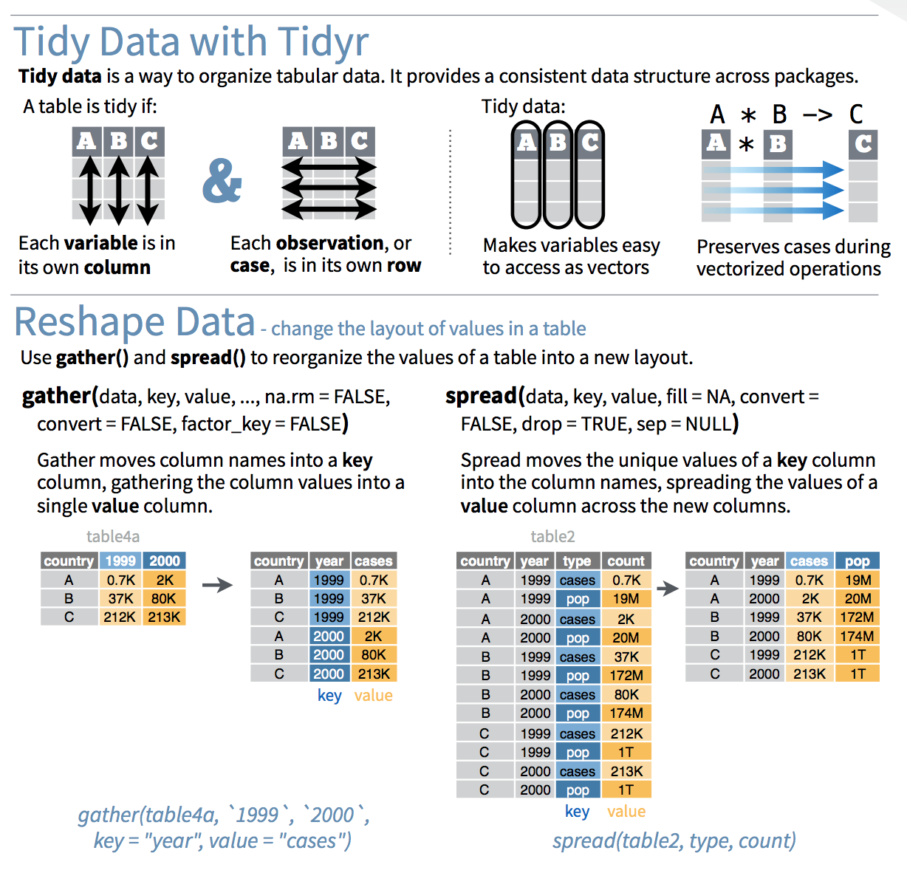

```{r setup, include=FALSE}
knitr::opts_chunk$set(echo = TRUE)
```

# Introductions

## Introductions
* Who are you/where do you work?
* What software/tools do you spend most time with? (Excel? SPSS? Tableau? etc)
* Do you have any programming experience? (Python? C? Javascript?)
* What do you hope to get out of this workshop? How do you see yourself using R in an IR environment?s

# Why use R?

## Why use R?
* Free
* Open-source
* A "statistical" programming language
    * Generally accepted by academic statisticians
    * Thoroughly grounded in statistical theory
* A great community
    * Help and support
    * Innovation and development
* R is a stable, well-supported language
    * Major corporate backing, e.g., Microsoft

## Growing fast!

```{r,eval=FALSE,echo=FALSE,message=FALSE}
# devtools::install_github('metacran/cranlogs')
# cran_R_downloads <- cranlogs::cran_downloads('R', from = '2012-10-01', to = '2018-09-30')
# readr::write_rds(cran_R_downloads, 'cran_R_downloads.rds', compress = 'gz')
cran_R_downloads <- read_rds('cran_R_downloads.rds')

cran_R_downloads %>% 
  group_by(lubridate::year(date), lubridate::month(date)) %>% 
  summarise(date = first(date), count = sum(count)) %>% 
  ggplot(aes(date, count)) +
  geom_line() +
  geom_smooth()

# R downloads not a great indicator, dependent on when releases are, etc
```


```{r,echo=FALSE,message=FALSE}
# crandl <- cran_downloads(from = '2012-10-01', to = '2018-09-30')
# write_rds(crandl, 'crandl.rds', compress = 'gz')
library(tidyverse)
library(lubridate)

crandl_monthly <- read_rds('crandl.rds') %>% 
  group_by(year(date), month(date)) %>% 
  summarise(date = first(date), count = sum(count))

ggplot(crandl_monthly, aes(date, count/1e6)) +
  geom_line() +
  geom_smooth(method = 'loess') +
  theme(axis.title.x = element_blank()) +
  labs(
    title = 'CRAN Package Downloads (Monthly)',
    y = 'Package Downloads (Millions)')
```

## Growing fast!


https://stackoverflow.blog/2017/10/10/impressive-growth-r/
    
## Some history
* Based on the S programming language
    * Dates from the late 1970s, substantially revised in the late 1980s
    * (there is still a commercial version, S-PLUS)
* R was developed at the University of Auckland
    * Ross Ihaka and Robert Gentleman
    * First developed in 1993
    * Stable public release in 2000
* RStudio
    * IDE, generally recognized as high quality, even outside R
    * Development began in 2008, first public release in February 2011
        * Version 1.0 in Fall 2016
    * There have been other IDEs for R in the past, but since RStudio came on the scene, most are no longer seriously maintained

## Some history
Why is this relevant?

* You'll likely notice some quirks in R that differ from other programming languages you make have worked in--the unique history often explains why.
* Explains R's position as a "statistical programming language":
    * Think stats/data first, programming second.

# Today's approach/Learning outcomes

## Today's approach/Learning outcomes
In learning R today, we'll take an approach, used in *R for Data Science* (Wickham & Grolemund, 2016), diagrammed like this:


One of the strengths of R: every step of this workflow can be done using it!

## Import
* Loading the data!
* For IR-type tasks, this will generally be from data files or directly from databases.
* Other possibilities include web APIs, or even web scraping

## Tidy
* "Tidy data" (Wickham, 2014)
    * Each column is a variable, each row is an observation.
* Doing this kind of work up front, right after loading, lets you focus on the modelling/analysis/visualization problem at hand, rather than having to rework your data at each stage of your analysis.

## Transform/Visualize/Model
>* Repeat these three steps as necessary:

## Transform
* Together with tidying, sometimes called _data wrangling_
    * Filtering (selecting specific observations)
    * Mutating (creating new variables)
    * Summarizing (means, counts, etc)

## Visualise
>* For both exploratory purposes and production/communication

## Model
>* Complementary to visualisation
>* For the "precise exploration" of "specific questions"

## Communicate
* The final output, whether it's just for yourself, your colleagues, or a wider audience
* Increasingly, there's a trend toward "reproducible research" which integrates even the communciation step (final paper, report, etc) into the code/analysis.

# Housekeeping

## Installing R and RStudio
* https://cran.r-project.org/
* https://www.rstudio.com/products/rstudio/download3/#download

* `install.packages('tidyverse')`

## Basic R
* An interpreted language (like Python)
* Code can be run as:
    * scripts (programatically/non-interactively)
    * from the prompt (interactively)
* R uses an REPL (Read-Evaluate-Print Loop) just like Python
    * Using R as a calculator (demonstration)
    
# Outline

## Outline
1. Visualisation
2. Transformation
3. Importing and 'wrangling'
4. Hands-on portion using what we've learned

# Visualisation

## Let's load our package
```{r}
library(tidyverse)
```

A package only needs to be *installed* once (per major version, e.g. 3.3.x to 3.4.x), but must be *loaded* every time.

## The 'mpg' data set
Data on the fuel efficiency of 38 models of cars between 1999 and 2008 from the US EPA:

```{r}
mpg
```

## The Grammar of Graphics
* Layers
* Inheritance
* Mapping (`aes`)

## Our First Plot
* A car's highway mileage (mpg) vs its engine size (displacement in litres).
* What might the relationship be?

## Our First Plot
```{r}
ggplot(data = mpg) + 
  geom_point(mapping = aes(x = displ, y = hwy))
```

* As engine size increases, fuel efficiency decreases, roughly.

## Exercises
* The first scatterplot was highway mileage vs displacement: how can we make it city mileage vs displacement?
* Make a scatterplot of `hwy` vs `cyl`.
* What about a scatterplot of `class` vs `drv`?

## Hwy vs cyl
```{r}
ggplot(data = mpg) + 
  geom_point(mapping = aes(x = hwy, y = cyl))
```

## Class vs drv
```{r}
ggplot(data = mpg) + 
  geom_point(mapping = aes(x = class, y = drv))
```

What's going on here? Is this useful? How might we make it more useful?

## Additional aesthetics
What about those outliers? Use the `color` aesthetic.

```{r}
ggplot(data = mpg) + 
  geom_point(mapping = aes(x = displ, y = hwy, color = class))
```

## 'Unmapped' aesthetics
What's happening here?

```{r}
ggplot(data = mpg) + 
  geom_point(mapping = aes(x = displ, y = hwy), color = "blue")
```

## What's gone wrong?
What's happened here? What colour are the points? Why?

```{r}
ggplot(data = mpg) + 
  geom_point(mapping = aes(x = displ, y = hwy, color = "blue"))
```

## Exercises
>* `mpg` variable types: which are categorical, which are continuous?
>* `?mpg`
>* Map a continuous variable to colour, size, and shape: how are these aesthetics different for categorical vs continuous?
>* What happens if you map an aesthetic to something other than a variable name, like `aes(color = displ < 5)`?

## Facets: One Variable
```{r}
ggplot(data = mpg) + 
  geom_point(mapping = aes(x = displ, y = hwy)) + 
  facet_wrap(~ class, nrow = 2)
```

**TODO: This might be a good point to talk about formulas - since we use the
formula notation with facets.

## Facets: Two Variables
```{r}
ggplot(data = mpg) + 
  geom_point(mapping = aes(x = displ, y = hwy)) + 
  facet_grid(drv ~ cyl)
```

## Other "geoms" (geometries)
```{r}
ggplot(data = mpg) + 
  geom_point(mapping = aes(x = displ, y = hwy))
```

## Smooth
```{r}
ggplot(data = mpg) + 
  geom_smooth(mapping = aes(x = displ, y = hwy))
```

## Smooth aesthetics
```{r}
ggplot(data = mpg) + 
  geom_smooth(mapping = aes(x = displ, y = hwy, linetype = drv))
```

## Which aesthetics do geoms have?
`?geom_smooth`

## Clearer?
```{r}
ggplot(data = mpg) + 
  geom_point(mapping = aes(x = displ, y = hwy, color = drv)) +
  geom_smooth(mapping = aes(x = displ, y = hwy, color = drv, linetype = drv))
```

## Reducing Duplication
```{r}
ggplot(data = mpg, mapping = aes(x = displ, y = hwy, color = drv)) + 
  geom_point() +
  geom_smooth(mapping = aes(linetype = drv))
```

## Exercise: Recreate:
```{r,echo=FALSE}
ggplot(mpg, aes(x=displ, y=hwy)) +
  geom_point() +
  geom_smooth(se=FALSE)
```

## Exercise: Recreate:
```{r,echo=FALSE}
ggplot(mpg, aes(x=displ, y=hwy, color=drv)) +
  geom_point() +
  geom_smooth(aes(color=NULL), se=FALSE)
```

## Exercise: Recreate:
```{r,echo=FALSE}
ggplot(mpg, aes(x=displ, y=hwy, color=drv)) +
  geom_point() +
  geom_smooth(se=FALSE)
```

## One last visualization
A common scenario:
```{r}
ggplot(data = diamonds) + 
  geom_bar(mapping = aes(x = cut, fill = clarity), position = "dodge")
```

# Coding basics

## R as a calculator
```{r}
1 / 200 * 30
```

```{r}
(59 + 73 + 2) / 3
```

```{r}
sin(pi / 2)
```

## Assignments
```{r}
x <- 3 * 4
```

## Calling functions
Calling R functions, in general:
```
function_name(arg1 = val1, arg2 = val2, ...)
```

An example function, `seq`:
```{r}
seq(1, 10)
```

# Data wrangling with `dplyr` and `tidyr` (`tidyverse`)

## Create RStudio project

1. File | New Project...
2. New Directory
3. Empty Project
4. Under "Directory name:" put in "CIRPA 2018", under "Create project as a subdirectory of:", pick somewhere you'll remember.
5. Click "Create Project", and RStudio will refresh, with your new project loaded.

## Download the data

We'll look at CANSIM Tables 0477-0058 and 0477-0059 which cover university revenues and expenditures, respectively.

TODO: Should we change the examples from CANSIM to a built in dataset?

<!---
1. Search Google for: cansim 477-0058
2. Follow the first result: "CANSIM - 477-0058 - Financial information of universities and degree ..."
3. Click the "Download" tab
4. At the bottom of the page, "Download entire table"
5. Click "Download file from CANSIM (CSV Version, 714.2 kb)" and save where your RStudio project is
6. Repeat steps 1 to 5 for cansim 477-0059.
--->

To save time, I've already downloaded the data from CANSIM. You can get it here:

http://evancortens.com/cirpa/

## Load the data

We'll use `read_csv()` from `readr`, which I prefer to the base R function, as it has some more sensible defaults, and it's faster.

```{r}
# http://www20.statcan.gc.ca/tables-tableaux/cansim/csv/04770058-eng.zip
# make sure the zip file is in the same directory as your RStudio project

revenue_raw <- read_csv('04770058-eng.zip') 
```

The `read_csv()` function tells us that it guessed the types of the various columns. In this situation, the default guesses are fine, but of course we can force it to treat columns certain ways if we wish.

## What does the data look like?

```{r}
revenue_raw
```

We have 8 columns and 122,240 rows of data. `read_csv()` brings the data in as a `tibble`, which is just an R "data frame", but with some handy defaults, some of which we're seeing here. For instance, it gives us the size of the data frame in rows and columns, the types of the columns (e.g., "&lt;chr&gt;" for character) and only prints the first 10 rows, instead of overwhelming us with all of the data.

## What does the data look like?

```{r,eval=FALSE}
View(revenue_raw) # in RStudio
```

Or click the icon in the `Environment` tab.

## What does the data look like?

```{r,eval=FALSE}
head(revenue_raw, 1) # show just the first row
```

>* *Ref_Date*: fiscal year
>* *GEO*: province or whole country
>* *SCHOOL*: Direct participation in CAUBO survey, or via Statistics Canada, or combined (we'll just look at this)
>* *REVENUE*: Type of income (e.g., tuition, provincial government, SSHRC, etc)
>* *FUND*: Classification of income "in accordance with activities or objectives as specified by donors, ... regulations, restrictions, or limitations" (We're just going to look at "Total funds (x 1,000)", but the distinctions are important for full analysis)
>* *Vector*: a CANSIM unique identifier
>* *Coordinate*: ditto
>* *Value*: the actual dollar value (x 1,000, per the FUND heading)

## What makes data "tidy"?

>1. Each variable must have its own column.
>2. Each observation must have its own row.
>3. Each value must have its own cell.

(See Wickham, 2014 and *R for Data Science*, chapter 12)

Is the CANSIM data tidy?

* Nope! So let's tidy it.

## dplyr basics
* Pick observations by their values (`filter()`).
* Reorder the rows (`arrange()`).
* Pick variables by their names (`select()`).
* Create new variables with functions of existing variables (`mutate()`).
* Collapse many values down to a single summary (`summarise()`).

* All can be used in conjunction with `group_by()`

## dplyr cheat sheet


https://www.rstudio.com/resources/cheatsheets/

(or Help | Cheatsheets in RStudio!)

<!---
## Cleanup To Do

* As it comes out of CANSIM, this data set contains a number of categories and columns we don't need today. 
* The data is also in what's often called a "long" format, where the names of the variables are stored in one column (`REVENUE`) and the actual values are stored in another (`Value`). 
* For certain types of analysis, we'll want to move into a "wide" format, where each column represents a variable.
--->

## `filter()` the rows we want

```{r}
filter(revenue_raw, 
       SCHOOL == 'Total universities and colleges', 
       FUND == 'Total funds (x 1,000)')
```

`filter()` help tells us that everything after the first argument (i.e., the "...") are: "Logical predicates defined in terms of the variables in .data. Multiple conditions are combined with &."

## Comparison operators

```{r, eval=FALSE}
>   # greater than
>=  # greater than or equal to
<   # less than
<=  # less than or equal to
!=  # not equal
==  # equal
  
%in% # not quite a comparison operator, but handy 
     # x %in% y is true if the values of vector x are present in vector y
```

## Logical operators

Other operators we can use with `filter()`:


Complete set of boolean operations. `x` is the left-hand circle, `y` is the right-hand circle, and the shaded regions show which parts each operator selects.

## `filter()`

In other words, the previous command is equivalent to this:

```{r}
filter(revenue_raw, 
       SCHOOL == 'Total universities and colleges' & 
         FUND == 'Total funds (x 1,000)')
```

I prefer this notation, as it's more explicit.

## `filter()`

But, one more thing: we need to assign the return value of the `filter()` function back to a variable:

```{r}

revenue <- filter(revenue_raw, 
                  SCHOOL == 'Total universities and colleges' & 
                    FUND == 'Total funds (x 1,000)')
```

Shortcut for assignment operator: Alt-Hyphen in RStudio

## Combining operations
A new variable for each step gets cumbersome, so `dplyr` provides an operator, the pipe (`%>%`) that combines operations:

```{r}
revenue_long <- revenue_raw %>% 
  # only rows matching this
  filter(SCHOOL == 'Total universities and colleges' & 
                    FUND == 'Total funds (x 1,000)') %>% 
  # remove these columns
  select(-SCHOOL, -FUND, -Vector, -Coordinate) %>% 
  # fix up the date column
  mutate(Ref_Date = as.integer(stringr::str_sub(Ref_Date, 1, 4)))
```

`x %>% f(y)` turns into `f(x, y)`, and `x %>% f(y) %>% g(z)` turns into `g(f(x, y), z)` etc.

Shortcut for pipe operator: Ctrl-Shift-M in RStudio

```{r}
head(revenue_long, 1) # looks good so far!
```

## Select helper functions
* There are a number of helper functions you can use within select():
    * `starts_with("abc")`: matches names that begin with "abc".
    * `ends_with("xyz")`: matches names that end with "xyz".
    * `contains("ijk")`: matches names that contain "ijk".
    * `matches("(.)\\1")`: selects variables that match a regular expression.
    * `num_range("x", 1:3)`: matches x1, x2 and x3.
    * `one_of(vector)`: columns whose names are in said vector.

## Tidy data with `tidyr`

The two main `tidyr` functions:

* `gather(data, key, value)`: Moves column names into a `key` column, with the values going into a single `value` column.
* `spread(data, key, value)`: Moves unique values of `key` column into column names, with values from the `value` column.

## `tidyr` Cheatsheet



https://www.rstudio.com/resources/cheatsheets/ (Data Import Cheatsheet)

## `spread()` CANSIM

```{r}
revenue <- revenue_long %>% 
  spread(REVENUE, Value)

revenue
```


## Visualizing

```{r}
revenue %>% 
  filter(GEO == 'Canada') %>% 
  # pass the result to ggplot() as the first argument
  ggplot(aes(Ref_Date, `Total revenues`)) +
  # now it switches to + to combine, which is ggplot's way
  geom_line()
```

Not the prettiest, but it works! 

## Visualizing: Labels
```{r}
revenue %>% 
  filter(GEO == 'Canada') %>% 
  ggplot(aes(Ref_Date, `Total revenues`)) +
  geom_line() +
  labs(title = 'Total University and Degree-Granting College Revenue',
       x = 'Fiscal Year',
       y = 'Revenue ($ thousands)') +
  scale_y_continuous(labels = scales::comma)
```

## Inline Calculation

```{r}
revenue %>% 
  filter(GEO %in% c('Canada', 'Alberta', 'Ontario')) %>% 
  ggplot(aes(Ref_Date, `Tuition and other fees` / `Total revenues`, color = GEO)) +
  geom_line() +
  labs(title = 'Tuition and fees as a share of total revenue') +
  scale_y_continuous(labels = scales::percent)
```

## Exercises

>1. Visualize another variable
>2. Set some appropriate labels and scales
>3. Graph a time subset (e.g., between 2005 and 2010)

## Other `dplyr` "verbs"

Which province took in the most tuition revenue in 2010?

```{r}
revenue %>%
  filter(GEO != 'Canada', Ref_Date == 2010) %>% 
  select(GEO, `Tuition and other fees`) %>% 
  arrange(desc(`Tuition and other fees`))
```

## Create a new variable

```{r}
revenue %>% 
  select(Ref_Date, GEO, `Tuition and other fees`, `Total revenues`) %>% 
  mutate(tuition_share = `Tuition and other fees` / `Total revenues`)
```

Keeps the same number of rows

## Useful "mutations"
* Arithmetic: `+, -, *, /, ^`
* Modular arithmetic: `%/%` (integer division), `%%` (remainder)
* Logs: `log(), log2(), log10()`
* Offsets: `lead()`, `lag()`
* Cumulative and rolling aggregates: `cumsum()`, `cumprod()`, `cummin()`, `cummax()`, `cummean()`
* Logical comparisons: `<, <=, >, >=, !=, ==`
* Ranking: `min_rank()`, `row_number()`, `dense_rank()`, `percent_rank()`, `cume_dist()`, `ntile()`
* `ifelse()`
* `recode()`
* `case_when()`

## Summarize (aggregate)

```{r}
revenue %>% 
  group_by(GEO) %>% 
  summarise(avg_endowment_revenue = mean(Endowment)) %>% 
  arrange(-avg_endowment_revenue)
```

## Useful summarising functions:
* `mean(x)`, `median(x)`
* `sd(x)`, `IQR(x)` (interquartile range), `mad(x)` (median absolute deviation)
* `min(x)`, `max(x)`, `quantile(x, 0.25)`
* `first(x)`, `nth(x, 2)`, `last(x)`
* `n(x)`, `n_distinct(x)`
* Counts and proportions of logical values: `sum(x > 10)`, `mean(y == 0)`
    * `TRUE` is converted to `1` and `FALSE` to `0`

## Exercise:

Compute the total tuition revenue of the three western-most provinces in 2007.

```{r}
revenue %>% 
  filter(GEO %in% c('British Columbia', 'Alberta', 'Saskatchewan'), Ref_Date == 2007) %>% 
  summarise(sum(`Tuition and other fees`))
```

## Group by new variable

These three provinces compared to all other provinces and national average.

```{r}
revenue %>% 
  filter(Ref_Date == 2007) %>% 
  mutate(category = case_when(
    GEO %in% c('British Columbia', 'Alberta', 'Saskatchewan') ~ '3 Western Provinces',
    GEO == 'Canada' ~ GEO,
    TRUE ~ 'All Other Provinces'
  )) %>% 
  group_by(category) %>% 
  summarise(sum(`Tuition and other fees`))
```

## Change relative first year

```{r}
tuition_relative_change <- revenue %>% 
  arrange(Ref_Date, GEO) %>% 
  group_by(GEO) %>%
  mutate(rel_change = (`Tuition and other fees` - first(`Tuition and other fees`)) / first(`Tuition and other fees`)) %>% 
  select(Ref_Date, GEO, `Tuition and other fees`, rel_change)

ggplot(tuition_relative_change, aes(Ref_Date, rel_change, color = GEO)) +
  geom_line()
```

## Logical sums

Count years with positive endowment income by province

```{r}
revenue %>% 
  group_by(GEO) %>% 
  summarise(num_pos_endow = sum(Endowment > 0))
```

## Exercises

* Compare the Maritimes to the rest of Canada on one or more variable
* Between 2005 and 2007, which provinces received more than $100 M in Total grants?
* Which provinces, other than Nova Scotia and Ontario, had more than $20 M in Endowmennt income in 2003?
* Which province was in "third place" in total revenue in 2012?

## `purrr` (quickly)

TODO: I think we remove the `purrr` section - as per discussion.

```{r}
revenue %>% 
  filter(GEO != 'Canada') %>% 
  group_by(Ref_Date) %>% 
  summarise(revenue_quantiles = list(quantile(`Total revenues`, c(0.25, 0.5, 0.75)))) %>% 
  mutate(
    low_25 = map_dbl(revenue_quantiles, "25%"),
    mid = map_dbl(revenue_quantiles, '50%'),
    high_75 = map_dbl(revenue_quantiles, '75%')
  )
```


# Vectors (and other types)

## Missing data
```{r}
NA > 5
```

```{r}
10 == NA
```

```{r}
NA + 10
```

What about this?

```
NA / 2
```

## Filtering and NAs

```{r}
x <- NA
is.na(x)
```

`filter()` only includes rows where the condition is `TRUE`; it excludes both `FALSE` and `NA` values. If you want to preserve missing values, ask for them explicitly:

```{r}
test_data <- tibble(x = c(1, NA, 3))
filter(test_data, x > 1)
```

```{r}
filter(test_data, is.na(x) | x > 1)
```

## Dealing with vectors...
```{r}
c(1, 2, 3)
```

```{r}
1:3
```

## Dealing with vectors...
```{r}
1:3 + 1:9
```

What about...

```
1:3 + 1:10
```

## Dealing with vectors...
```{r}
1:3 + 1:10
```

What happened?

## Missing values
```{r}
mean(c(1,2,3))
```

What do we expect here?

```
mean(c(1,NA,3))
```

## Missing values
```{r}
mean(c(1,NA,3))
```

```{r}
mean(c(1,NA,3), na.rm = TRUE)
```

## Vectors


## Vectors
* Coercion (explicit and implicit)
    * Type hierarchy
* Atomic vectors (homogenous) vs lists (can nest/heterogeneous)
* Names
* Subsetting

## Vectors: Naming

```{r}
c(x = 1, y = 2, z = 4)

set_names(1:3, c("a", "b", "c"))
```

## Vectors: Subsetting
```{r}
# positive values
x <- c("one", "two", "three", "four", "five")
x[c(3, 2, 5)]

# negative values
x[c(-1, -3, -5)]
#> [1] "two"  "four"

# subset a named vector w/character vector
x <- c(abc = 1, def = 2, xyz = 5)
x[c("xyz", "def")]
```

## Vectors: Logical subsetting
```{r}
x <- c(10, 3, NA, 5, 8, 1, NA)

# All non-missing values of x
x[!is.na(x)]
#> [1] 10  3  5  8  1

# All even (or missing!) values of x
x[x %% 2 == 0]
#> [1] 10 NA  8 NA
```

## Lists

```{r}
x <- list(1, 2, 3)
x
str(x) # str...ucture
```

## Lists: Can contain different types of objects:
```{r}
y <- list("a", 1L, 1.5, TRUE)
str(y)
```

## Lists: Or other lists:
```{r}
z <- list(list(1, 2), list(3, 4))
str(z)
```

# Modeling

When we have the data the way we want it, we want to ask questions about it.
To determine the relationship between parts of the data.

This can range from exploratory modeling (to better understand the data) to
more formally trying to establish relationships between variables.
The process is the same for both, but the mindset is different.

## Types of Modeling

* define a family of models - expressed as an equation - you are trying to estimate the **parameters** of the question
* generate a fitted model that fills in the parameters

### The goal

You are trying to get the model from the family that best fits the data.
That doesn't mean it's a "good" or "true" model.

## Simulated Data

The `modelr` package has a simulated dataset called `sim1`.

```{r}
library(modelr)
sim1$x
```

## Plotting `sim1`

```{r}
ggplot(sim1, aes(x, y)) +
  geom_point()
```

## Plotting `sim1`

```{r, echo=FALSE}
ggplot(sim1, aes(x, y)) +
  geom_point()
```

* we can see that there is a pattern from the scatter plot
* the pattern looks like a straight line - `geom_abline` plots straight line on the graph

## Using `geom_abline`

```{r}
ggplot(sim1, aes(x, y)) +
  geom_point() +
  geom_abline(aes(intercept = 12, slope = 0.5))
```

## Using `geom_abline`

```{r, echo=FALSE}
ggplot(sim1, aes(x, y)) +
  geom_point() +
  geom_abline(aes(intercept = 12, slope = 0.5))
```

That's just one model - how can we tell if it's good or not?

## Evaluating Predictive Models

We look at the difference between the predictions and the
actual data.

```{r, echo = FALSE}
dist1 <- sim1 %>% 
  mutate(
    dodge = rep(c(-1, 0, 1) / 20, 10),
    x1 = x + dodge,
    pred = 12 + x1 * 0.5
  )

ggplot(dist1, aes(x1, y)) + 
  geom_abline(intercept = 12, slope = 0.5, colour = "grey40") +
  geom_point(colour = "grey40") +
  geom_linerange(aes(ymin = y, ymax = pred), colour = "#3366FF") 
```

## Defining a model as an R function

We can find this for any model by creating an R function.
We take the intercept and add the slope multiplied by `x`.
```{r}
model1 <- function(data, a) {
  a[1] + data$x * a[2]
}

model1(sim1, c(12, 0.5))
```

## Difference between predicted and actual

Once we have the model's prediction, we can look at the difference between those and what the actual data is.

```{r}
measure_distance <- function(data, mod) {
  diff <- data$y - model1(data, mod)
  diff
}
measure_distance(sim1, c(12, 0.5))
```

## Using squared distances

We want to both put all distances as positive numbers and more heavily penalize predictions that are far from the actual values - so we square the diffference.

```{r}
measure_distance <- function(data, mod) {
  diff <- data$y - model1(data, mod)
  diff ^ 2
}
measure_distance(sim1, c(12, 0.5))
```

## Summary Measure of Distance

We want to summarize it - so we take the mean across all the predictions and take the square root to put the differences back in terms of the original units.

```{r}
measure_distance <- function(data, mod) {
  diff <- data$y - model1(data, mod)
  sqrt(mean(diff ^ 2))
}
measure_distance(sim1, c(12, 0.5))
```

## Use this message to choose a model

So, to choose between models -- we can just put in different values.
```{r}
measure_distance(sim1, c(7, 1.5))
```

## Random Models Compared

So, we can generate a lot of models and pick the one with the lowest error.

```{r}
models <- tibble(
  a1 = runif(250, -20, 40),
  a2 = runif(250, -5, 5)
)

sim1_dist <- function(a1, a2) {
  measure_distance(sim1, c(a1, a2))
}

models %>%
  mutate(dist = purrr::map2_dbl(a1, a2, sim1_dist)) -> models
models
```

## Plot the Random Models

```{r}
ggplot(sim1, aes(x, y)) +
  geom_abline(aes(intercept = a1, slope = a2), data = models, alpha = 1/4) +
  geom_point()
```

## The 10 Best Models

```{r}
models %>%
  filter(rank(dist) <= 10) %>%
  arrange(dist)
```

## Plot all the random models.

Plot those models on the data.
Lighter colored models are closer.
```{r}
ggplot(sim1, aes(x, y)) +
  geom_point(size = 2, color = "grey30") +
  geom_abline(
    aes(intercept = a1, slope = a2, color = -dist),
    data = filter(models, rank(dist) <= 10)
  )
```

## Parameter Space

Now, we switch to parameter space...
We plot every candidate model - showing the distance in color.
We highlight our 10 best models in red.

```{r}
ggplot(models, aes(a1, a2)) +
  geom_point(data = filter(models, rank(dist) <= 10), size = 4, colour = "red") + 
  geom_point(aes(colour = -dist))
```

## Zoom In

So, you can zoom in on the area where the best models tend to be. Note the axes and the legend.

```{r}
grid <- expand.grid(
  a1 = seq(-5, 20, length = 25),
  a2 = seq(1, 3, length = 25)
  ) %>%
  mutate(dist = purrr::map2_dbl(a1, a2, sim1_dist))
```

```{r}
fine_grid <- expand.grid(
  a1 = seq(-5, 20, length = 50),
  a2 = seq(1, 3, length = 50)
  ) %>%
  mutate(dist = purrr::map2_dbl(a1, a2, sim1_dist))
```

## The new best 10 models

What do we get as the new best 10 models?

```{r}
grid %>%
  filter(rank(dist) <= 10) %>%
  arrange(dist)
```

```{r}
fine_grid %>%
  filter(rank(dist) <= 10) %>%
  arrange(dist)
```

## Plot the new best 10 models

```{r}
grid %>%
  ggplot(aes(a1, a2)) +
  geom_point(data = filter(grid, rank(dist) <= 10), size = 4, colour = "red") +
  geom_point(aes(colour = -dist))
```

## Contour Map

```{r}
grid %>%
  ggplot(aes(a1, a2, z=-dist)) +
  geom_contour()
```

## Contour Map (2)

```{r}
grid %>%
  ggplot(aes(a1, a2)) +
  geom_point(data = filter(grid, rank(dist) <= 10), size = 4, colour = "red") +
  geom_point(aes(colour = -dist)) + 
  geom_contour(aes(z = -dist), colour = "green")
```

## A finer contour map

```{r}
fine_grid %>%
  ggplot(aes(a1, a2)) +
  geom_point(data = filter(fine_grid, rank(dist) <= 10), size = 3, colour = "red") +
  geom_point(aes(colour = -dist)) + 
  geom_contour(aes(z = -dist), colour = "orange", bins = 15, size = 1.5)
```

## Overlay those 10 best models on the data.

```{r}
ggplot(sim1, aes(x, y)) +
  geom_point(size = 2, colour = "grey30") +
  geom_abline(
    aes(intercept = a1, slope = a2, colour = -dist),
    data = filter(grid, rank(dist) <= 10)
  )
```

## Optimize the models

There is a tool to optimize the parameters so you get the smallest distance.

```{r}
best <- optim(c(0, 0), measure_distance, data = sim1)
best$par
```

## Plot the optimal model

```{r}
ggplot(sim1, aes(x, y)) +
  geom_point(size = 2, colour = "grey30") +
  geom_abline(intercept = best$par[1], slope = best$par[2])
```

## R can do all of this in 1 command

Of course, R has a tool to do this whole process automatically.
This is our standard OLS regression.

```{r}
sim1_mod <- lm(y ~ x, data = sim1)
coef(sim1_mod)
```

## Generate Predictions

We can use a model object like `sim1_mod` to generate predictions.
We an start with an empty grid.

```{r}
grid <- sim1 %>%
  data_grid(x)
grid
```

## Generate Predictions (2)

```{r}
grid <- grid %>%
  add_predictions(sim1_mod)
grid
```

## Plot those predictions using `geom_line`.

```{r}
ggplot(sim1, aes(x)) +
  geom_point(aes(y = y)) +
  geom_line(aes(y = pred), data = grid, colour = "red", size = 1)
```

## Add residuals

Add residuals. We need to use the original dataset.

```{r}
sim1 <- sim1 %>%
  add_residuals(sim1_mod)
sim1
```

## Plot Residuals

```{r}
ggplot(sim1, aes(resid)) +
  geom_freqpoly(binwidth = 0.5)
```

## Plot Residuals

```{r}
ggplot(sim1, aes(x, resid)) +
  geom_ref_line(h = 0) +
  geom_point()
```

## _t_-tests

```{r}
t.test(disp ~ vs, data = mtcars)
```

## Correlation

```{r}
cor.test(mtcars$disp, mtcars$vs)
```

## Chi Squared (1)

Smoking and Exercise

```{r}
library(MASS)
tbl <- table(survey$Smoke, survey$Exer)
tbl
```

## Chi Squared (2)

```{r}
chisq.test(tbl)
```

# Capstone Exercise

The DC BikeShare Dataset has the number of bike share rides on each particularly day or time.
There are two datasets: one with the total number of rides per day and one with the number
of rides per hour.

Also included with the data is the weather.

## Thy these

Things to try:

1. Find some outliers and why they happened (try googling specific dates).
2. Estimate the effect that the seasons have on bike share usage? Day of the week?
3. Build a model that predicts bike share usage for a given day. Separate your data into three
parts.

## Notes

TODO: Add more content here.

* The R formula language -- using concepts from how the Tidyverse handles fields.
  * `data = .`
  * describe how to go from equations to R formulas - the `~` is the `=` we would write in an equation.
	`y ~ x` translates to `y = a_1 + a_2 * x`
  * `model_matrix` function 
  * categorical variables -- does that mean we have to deal with factors?
* statistical testings `t.test` - use the formula language -- come up with examples.
* modeling using `lm` - also use the formula language

# Additional Resources

## Online Resources

Start here:

>* http://r4ds.had.co.nz/
>* http://stat545.com/

Additional:

>* http://adv-r.had.co.nz/
>* http://r-pkgs.had.co.nz/
>* http://swcarpentry.github.io/r-novice-inflammation/
>* https://rstudio-education.github.io/hopr/preface.html

For help/community:

>* http://stackoverflow.com/questions/tagged/r
>* https://twitter.com/search?q=%23rstats
>* https://www.r-project.org/mail.html (Though they're not terribly welcoming to newbies sometimes...)

## Print Books
>* https://us.sagepub.com/en-us/nam/discovering-statistics-using-r/book236067%20
>* https://us.sagepub.com/en-us/nam/an-r-companion-to-applied-regression/book233899
>* http://shop.oreilly.com/product/0636920028574.do

## References
>* Wickham, Hadley (2014). https://www.jstatsoft.org/article/view/v059i10
